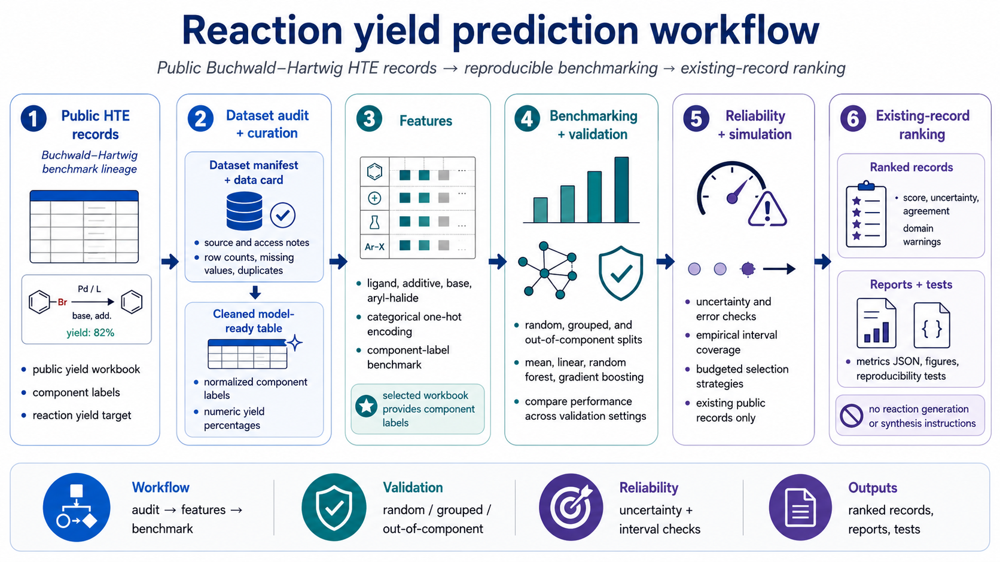
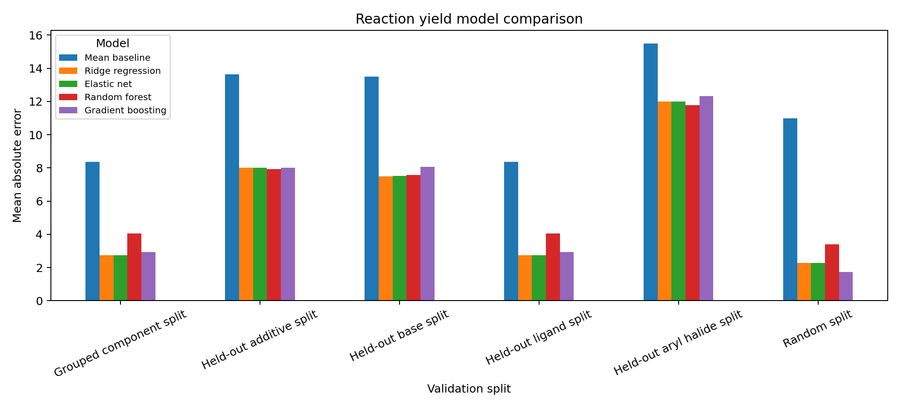
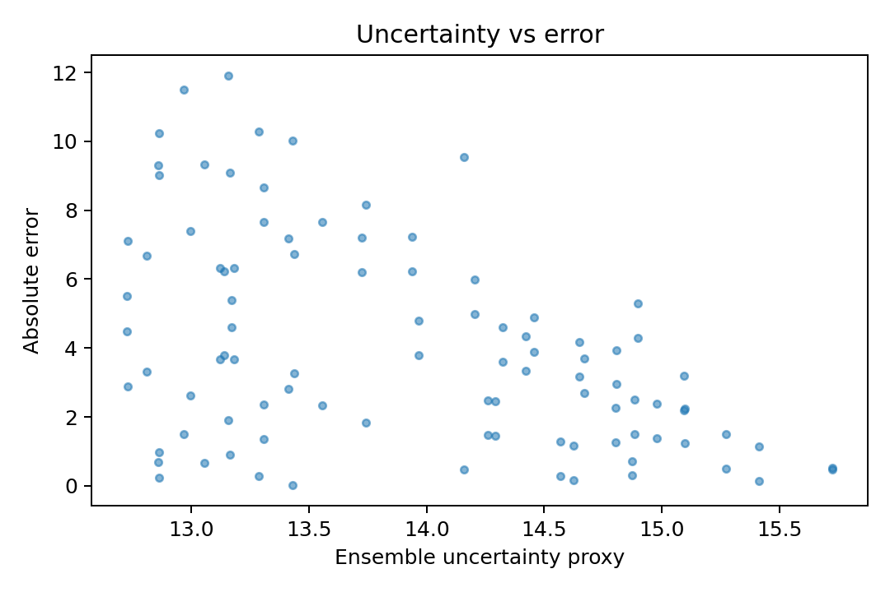
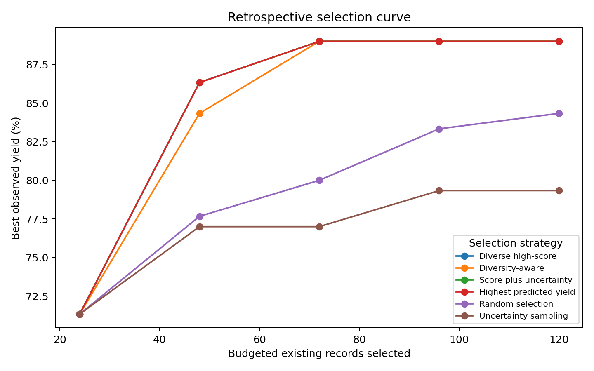

# Reaction Yield Prediction from Public HTE Data

This project builds a reaction-yield modeling workflow using public high-throughput experimentation (HTE) data. I curated public Buchwald-Hartwig reaction-yield records, built categorical component-label features, benchmarked simple ML models, and tested whether performance holds when reaction components are held out rather than only shuffling rows.

The goal is to evaluate how far public HTE records can support yield prediction, uncertainty checks, out-of-component validation, active-learning simulation, and existing-record ranking without generating new chemistry or claiming experimental success.

## Table of Contents

- [Project Workflow](#project-workflow)
- [Model Benchmarking and Selection](#model-benchmarking-and-selection)
- [Main Results](#main-results)
  - [Out-of-Component Validation](#out-of-component-validation)
  - [Uncertainty and Error Checks](#uncertainty-and-error-checks)
  - [Active-Learning Simulation](#active-learning-simulation)
- [Scope and Limits](#scope-and-limits)
- [Reproduce](#reproduce)
- [Repository Layout](#repository-layout)
- [Useful Files](#useful-files)

## Project Workflow

This repository keeps the full retrospective benchmark in one reproducible place:

- selects the public Buchwald-Hartwig HTE yield workbook from the Ahneman, Dreher, and Doyle benchmark lineage
- writes a dataset manifest and data card with source, access, target, component columns, and limitations
- audits row counts, missing values, duplicate records, component availability, target range, and component cardinalities
- cleans the reaction-yield table into model-ready records with numeric yield percentages and normalized component labels
- builds categorical one-hot features from ligand, additive, base, and aryl-halide labels
- creates random, grouped, and out-of-component validation splits
- benchmarks mean, linear, random forest, and gradient boosting models
- evaluates uncertainty/error behavior and empirical interval coverage
- simulates budgeted selection strategies over existing public records
- ranks existing dataset records with model score, uncertainty, agreement, and domain warnings
- generates reports, metrics JSON files, figures, and lightweight reproducibility tests

The selected workbook provides component labels. This is therefore a component-label benchmark.



## Model Benchmarking and Selection

The benchmark compares a mean predictor, one-hot linear baselines, random forest, and gradient boosting. The generated reports select the random forest on the additive-held-out grouped split as the primary practical baseline.

The validation logic is the important part:

- Random split is the easier row-shuffle benchmark.
- Out-of-component split is the harder test where selected reaction components are held out.
- This checks whether the model generalizes beyond very similar component combinations.

In this dataset, the primary grouped split holds out additives, so it is equivalent to the held-out additive split. The aryl-halide held-out split is the weakest generalization case and should be read as an important limitation.



Full per-model, per-split metrics are in `reports/model_quality_review_report.md`.

## Main Results

| Area | Result | Interpretation |
|---|---|---|
| Dataset | 3,955 public HTE records | Main benchmark table from the public Buchwald-Hartwig workbook |
| Features | 44 one-hot component-label features | Categorical component-based representation |
| Best random split model | random forest, MAE 8.9717, RMSE 11.6171, R2 0.8266 | Easier shuffled-row benchmark |
| Selected out-of-component model | random forest on additive-held-out grouped split, MAE 10.7537, RMSE 14.2371, R2 0.7262 | Harder component-generalization check |
| Mean-baseline comparison | primary split MAE improves from 22.9984 to 10.7537 | The selected model clearly beats a naive yield-average baseline |
| Uncertainty check | empirical 90% coverage 0.7978, uncertainty-error Spearman 0.6296 | Useful diagnostic signal, but undercalibrated |
| Active-learning simulation | component-diverse high-score top-yield recovery 0.6762 at final budget; random baseline 0.1232 | Tests prioritization behavior over existing records |
| Ranked outputs | `reports/ranked_existing_reaction_records.csv`, 3,955 records | Existing-record review table |

### Out-of-Component Validation

Random splits can overestimate performance because similar component combinations may appear in both train and test data. Out-of-component validation is stricter because the model must predict reactions involving held-out components.

The selected random forest performs well on the additive, base, and ligand held-out checks, but it is much weaker on the aryl-halide held-out split:

| Split | Random forest MAE | Random forest R2 | Readout |
|---|---:|---:|---|
| Random split | 8.9717 | 0.8266 | Easier shuffled-row benchmark |
| Additive held out | 10.7537 | 0.7262 | Primary grouped split |
| Base held out | 9.4873 | 0.7449 | Strong held-out component result |
| Ligand held out | 10.7548 | 0.7665 | Strong held-out component result with shifted yield distribution |
| Aryl halide held out | 15.4660 | 0.2555 | Weakest generalization case |

### Uncertainty and Error Checks

Error diagnostics are used to find weak regions of the model. Empirical coverage checks whether uncertainty intervals behave as expected, while uncertainty/error rank correlation checks whether larger uncertainty tends to align with larger errors.

On the primary additive-held-out split, the empirical 90% interval coverage is 0.7978 and the uncertainty-error Spearman correlation is 0.6296. That makes the uncertainty estimates useful as review aids.



### Active-Learning Simulation

The active-learning simulation runs over existing public records. It tests whether a prioritization strategy would find high-yield records efficiently under a fixed review budget.

Each selected item is an existing record from the public benchmark table.

At the final simulated budget of 474 existing records, component-diverse high-score selection has the strongest top-yield recovery among the tested strategies. Best-yield curves partly saturate, so top-yield recovery and average selected yield are more informative than the single best-yield value.



## Scope and Limits

This is a retrospective public-data ML benchmark. It does not generate new chemistry, provide synthesis instructions, or claim experimental success.

The ranking and active-learning outputs review existing public records only. The current model uses component labels, not molecular structures, reaction SMILES, RDKit descriptors, Morgan fingerprints, graph neural networks, or prospective validation.

## Reproduce

Full public-data workflow:

```bash
make setup
make data
make features
make train
make evaluate
make active-learning
make report
make test
```

Small fixture path for smoke testing only:

```bash
make reproduce-small
make test
```

Fixture-mode outputs are synthetic code-path checks and are not public benchmark results.

## Repository Layout

```text
src/reaction_yield_ml/        package code, models, validation, reporting, and workflow entry points
data/                         dataset cards, public-source manifest, fixture, and generated intermediates
reports/                      generated reports, metrics, figures, and existing-record ranking output
docs/                         model/data cards, extension notes, assets, and walkthrough notebook
tests/                        lightweight reproducibility and quality-gate tests
Makefile                      reproducible command surface for the full workflow
```

The command wrappers live in `src/reaction_yield_ml/workflows/` and are run through the Makefile. The walkthrough notebook lives in `docs/notebooks/` because it is documentation, not runtime code.

## Useful Files

- `reports/final_project_report.md`
- `reports/model_quality_review_report.md`
- `reports/model_benchmark_report.md`
- `reports/validation_design_report.md`
- `reports/uncertainty_calibration_report.md`
- `reports/active_learning_report.md`
- `reports/existing_record_ranking_report.md`
- `reports/ranked_existing_reaction_records.csv`
- `reports/figures/model_comparison_by_split.png`
- `reports/figures/uncertainty_vs_error.png`
- `reports/figures/active_learning_budget_curve.png`
- `docs/assets/reaction_yield_workflow.png`
- `data/DATA_CARD.md`
- `docs/model_card.md`
- `docs/STRUCTURE_AWARE_REACTION_EXTENSION.md`
- `docs/notebooks/reaction_yield_ml_walkthrough.ipynb`

Machine-readable summaries are under `reports/metrics/`.
